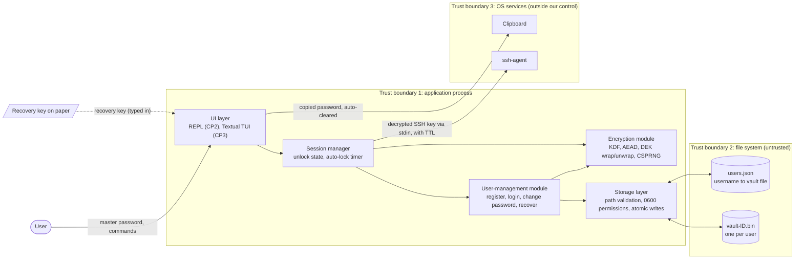

# Design Document: Password Manager

ICS0022 Secure Programming, semester project. Checkpoint 1: threat model and architecture.

## 1. Assets

Threat-modelling step 1: identify what the system must protect.
C = confidentiality, I = integrity, A = availability.

| # | Asset | Where it lives | Protect |
|---|---|---|---|
| A1 | **Stored credentials**: site usernames, passwords, URLs, notes | Encrypted in the user's vault file; plaintext in RAM while unlocked | C, I, A |
| A2 | **Master password** | User's memory, then keyboard/terminal input, then RAM until the key is derived | C |
| A3 | **Keys**: the key-encryption key (KEK) derived from the master password, and the random data key (DEK) that encrypts the vault | RAM only, while unlocked; the DEK is stored on disk only in wrapped (encrypted) form | C |
| A4 | **Vault file**: ciphertext, wrapped DEKs, KDF salt and parameters, nonce, authentication tag | Disk, one file per user | I, A |
| A5 | **User account records**: username to vault-file mapping | Disk | I |
| A6 | **TOTP secrets**: 2FA seeds for the user's other accounts | Inside the vault; RAM while unlocked | C |
| A7 | **SSH private keys** | Inside the vault; RAM; the OS ssh-agent until the TTL expires | C |
| A8 | **Transient output**: clipboard contents, terminal screen and scrollback | OS clipboard, terminal | C |
| A9 | **Recovery key**: shown once at registration, kept by the user on paper | Paper (outside the system); RAM while it is being used | C |

Notes:

- A1 and A4 are the same data in two states. The file's confidentiality comes from encryption, but the
  file itself must also be protected against tampering, rollback to an older copy, and loss.
- The KEK and the DEK (A3) are more valuable than the master password: anyone holding them does not need
  the password at all, and they stay in memory for the whole unlocked session.
- TOTP secrets (A6) are stored next to the passwords, so one breach of the vault defeats both factors.
  This is a deliberate usability trade-off.
- The recovery key (A9) is a second way into the vault, as powerful as the master password. It exists
  for availability: without it, a forgotten master password means the vault is permanently lost.

## 2. Architecture

Threat-modelling steps 2 and 3: architecture overview and decomposition.

The UI is a thin layer on top of a UI-independent core, so the prompt REPL (CP2) can be replaced by a
Textual TUI (CP3) without touching any security code. The UI never handles keys or files directly.

### Components

| Component | Responsibility | Holds secrets? |
|---|---|---|
| UI layer | Reads input, shows results. Masks password input and never echoes secrets. | Master password briefly, while it is passed on |
| Session manager | Keeps the unlocked state; locks and discards keys after inactivity or on `lock`/`quit` | DEK while unlocked |
| User-management module | Registration, login, master-password change, recovery-key unlock; one vault per user | Master password and KEK, briefly |
| Encryption module | Derives keys from passwords, encrypts and decrypts the vault (authenticated), wraps and unwraps the DEK, generates passwords and keys with a CSPRNG | Keys only for the duration of a call |
| Storage layer | The only component that touches the disk: validates paths, creates files with owner-only permissions, writes atomically (temp file, then rename) | Never plaintext, only ciphertext |

### Where files and keys live

| Item | Location | Form |
|---|---|---|
| Vault contents (A1, A6, A7) | `vault-<id>.bin` on disk | Encrypted and authenticated with the DEK |
| DEK | Vault file header | Wrapped twice: by the KEK from the master password, and by the key from the recovery key |
| KEK | RAM only | Derived at login, discarded after the DEK is unwrapped |
| DEK in plaintext | RAM only | Only while unlocked; dropped on lock, auto-lock or exit |
| Master password / recovery key | Never stored | Typed in, used to derive a key, then dropped |
| Account records (A5) | `users.json` | No secrets; its integrity is checked because each vault is bound to its username |

### Trust boundaries

1. **User and terminal to process.** All input is untrusted and validated against an allow-list
   (entry names, lengths, commands).
2. **Process to file system.** The disk is untrusted: another OS user, malware or a backup tool may
   read, copy, replace or roll back files. Everything written there is therefore encrypted and
   authenticated, and file paths are never built from raw user input.
3. **Process to OS services.** Data given to the clipboard or the ssh-agent leaves our control. We
   limit its lifetime (clipboard clearing, agent TTL) but cannot enforce it.
4. **User to user.** Accounts are separated cryptographically: each user has their own vault and their
   own keys. One user's password can never decrypt another user's vault.

### Data flow: unlock

1. The user enters their username and master password (input masked).
2. The storage layer finds the user's vault file through `users.json` and reads its header.
3. The encryption module derives the KEK from the password and the salt in the header, then unwraps the DEK.
   If the authentication tag fails, the login fails with a generic error; there is no separate password check that could leak information.
4. The DEK decrypts the vault into RAM. The password and the KEK are dropped.
5. The session manager keeps the DEK until lock, auto-lock or exit. Every save re-encrypts the vault with a fresh nonce and writes it atomically.
