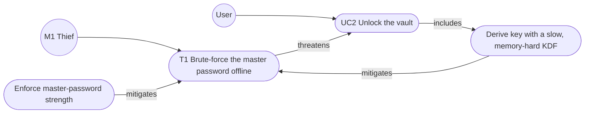

# Design Document: Password Manager

ICS0022 Secure Programming, semester project. Checkpoint 1: threat model and architecture.

## 1. Assets

Threat-modelling step 1: identify what the system must protect.
C = confidentiality, I = integrity, A = availability.

| # | Asset | Where it lives | Protect |
|---|---|---|---|
| A1 | **Stored credentials**: site usernames, passwords, URLs, notes | Encrypted in the user's vault file; plaintext in RAM while unlocked | C, I, A |
| A2 | **Master password** | User's memory, then keyboard/terminal input, then RAM until the key is derived | C |
| A3 | **Keys**: the key-encryption key (KEK) derived from the master password, and the random data key (DEK) that encrypts the vault | RAM only, while unlocked; the DEK is stored on disk only in wrapped (encrypted) form | C |
| A4 | **Vault file**: ciphertext, wrapped DEKs, KDF salt and parameters, nonce, authentication tag | Disk, one file per user | I, A |
| A5 | **User account records**: username to vault-file mapping | Disk | I |
| A6 | **TOTP secrets**: 2FA seeds for the user's other accounts | Inside the vault; RAM while unlocked | C |
| A7 | **SSH private keys** | Inside the vault; RAM; the OS ssh-agent until the TTL expires | C |
| A8 | **Transient output**: clipboard contents, terminal screen and scrollback | OS clipboard, terminal | C |
| A9 | **Recovery key**: shown once at registration, kept by the user on paper | Paper (outside the system); RAM while it is being used | C |

Notes:

- A1 and A4 are the same data in two states. The file's confidentiality comes from encryption, but the
  file itself must also be protected against tampering, rollback to an older copy, and loss.
- The KEK and the DEK (A3) are more valuable than the master password: anyone holding them does not need
  the password at all, and they stay in memory for the whole unlocked session.
- TOTP secrets (A6) are stored next to the passwords, so one breach of the vault defeats both factors.
  This is a deliberate usability trade-off.
- The recovery key (A9) is a second way into the vault, as powerful as the master password. It exists
  for availability: without it, a forgotten master password means the vault is permanently lost.

## 2. Architecture

Threat-modelling steps 2 and 3: architecture overview and decomposition.

The UI is a thin layer on top of a UI-independent core, so the prompt REPL (CP2) can be replaced by a
Textual TUI (CP3) without touching any security code. The UI never handles keys or files directly.

### Components

| Component | Responsibility | Holds secrets? |
|---|---|---|
| UI layer | Reads input, shows results. Masks password input and never echoes secrets. | Master password briefly, while it is passed on |
| Session manager | Keeps the unlocked state; locks and discards keys after inactivity or on `lock`/`quit` | DEK while unlocked |
| User-management module | Registration, login, master-password change, recovery-key unlock; one vault per user | Master password and KEK, briefly |
| Encryption module | Derives keys from passwords, encrypts and decrypts the vault (authenticated), wraps and unwraps the DEK, generates passwords and keys with a CSPRNG | Keys only for the duration of a call |
| Storage layer | The only component that touches the disk: validates paths, creates files with owner-only permissions, writes atomically (temp file, then rename) | Never plaintext, only ciphertext |

### Where files and keys live

| Item | Location | Form |
|---|---|---|
| Vault contents (A1, A6, A7) | `vault-<id>.bin` on disk | Encrypted and authenticated with the DEK |
| DEK | Vault file header | Wrapped twice: by the KEK from the master password, and by the key from the recovery key |
| KEK | RAM only | Derived at login, discarded after the DEK is unwrapped |
| DEK in plaintext | RAM only | Only while unlocked; dropped on lock, auto-lock or exit |
| Master password / recovery key | Never stored | Typed in, used to derive a key, then dropped |
| Account records (A5) | `users.json` | No secrets; its integrity is checked because each vault is bound to its username |

### Trust boundaries

1. **User and terminal to process.** All input is untrusted and validated against an allow-list
   (entry names, lengths, commands).
2. **Process to file system.** The disk is untrusted: another OS user, malware or a backup tool may
   read, copy, replace or roll back files. Everything written there is therefore encrypted and
   authenticated, and file paths are never built from raw user input.
3. **Process to OS services.** Data given to the clipboard or the ssh-agent leaves our control. We
   limit its lifetime (clipboard clearing, agent TTL) but cannot enforce it.
4. **User to user.** Accounts are separated cryptographically: each user has their own vault and their
   own keys. One user's password can never decrypt another user's vault.

### Data flow: unlock

1. The user enters their username and master password (input masked).
2. The storage layer finds the user's vault file through `users.json` and reads its header.
3. The encryption module derives the KEK from the password and the salt in the header, then unwraps the DEK.
   If the authentication tag fails, the login fails with a generic error; there is no separate password check that could leak information.
4. The DEK decrypts the vault into RAM. The password and the KEK are dropped.
5. The session manager keeps the DEK until lock, auto-lock or exit. Every save re-encrypts the vault with a fresh nonce and writes it atomically.

## 3. Threat model

Threat-modelling steps 4 to 6: identify, document and rate the threats. Threats are written as
**misuse cases** (Alexander, *Misuse Cases*, 2003): a misuse case **threatens** a use case, and a use
case (a security function of the tool) **mitigates** a misuse case.

### Use cases

| ID | Use case |
|---|---|
| UC1 | Register an account (creates the vault and shows the recovery key once) |
| UC2 | Unlock the vault (log in) |
| UC3 | Add, view, edit or delete an entry |
| UC4 | Copy a password to the clipboard |
| UC5 | Generate a password |
| UC6 | Lock / auto-lock |
| UC7 | Change the master password |
| UC8 | Recover access with the recovery key |
| UC9 | Show a TOTP code |
| UC10 | Load an SSH key into the ssh-agent |

### Misusers

| ID | Misuser | Capability |
|---|---|---|
| M1 | **Thief** | Has a copy of the files: stolen laptop or disk, backup, cloud sync. Unlimited offline time. |
| M2 | **Local user** | Another person or OS account on the same machine, or another account of this tool. |
| M3 | **Malware** | Code running as the same OS user while the tool is in use. |
| M4 | **Onlooker** | Can see the screen or the paper recovery key. |

Rating: likelihood (L/M/H) times impact (L/M/H) gives a risk of Low, Medium or High.

### Example misuse-case diagram (master password area)

### Master password (A2, A9)

| ID | Misuse case (misuser) | Threatens | Risk | Mitigation | Residual risk |
|---|---|---|---|---|---|
| T1 | Brute-force the master password offline against a copied vault file (M1) | UC2 | High | Memory-hard KDF (Argon2id) with a per-user random salt; minimum length and a blocklist of common passwords at UC1/UC7 | A weak but allowed password can still be guessed eventually |
| T2 | Guess passwords online at the login prompt (M2) | UC2 | Medium | The KDF makes every attempt slow; a growing delay after each failure | The offline attack (T1) skips the prompt entirely |
| T3 | Read the password as it is typed (M4) | UC2 | Low | Masked input, never echoed | Physical observation of the keyboard |
| T4 | Learn which usernames exist from error messages or timing (M2) | UC2 | Low | One generic login error; the KDF also runs for unknown usernames | None significant |
| T5 | Steal or photograph the paper recovery key (M4) | UC8 | Medium | High-entropy key shown only once; using it forces a new master password and a new recovery key | Unlike 1Password's Emergency Kit, which is a second factor, our recovery key alone opens the vault. This is a deliberate trade of confidentiality for availability |

### Vault at rest (A1, A4, A5, A6, A7)

| ID | Misuse case (misuser) | Threatens | Risk | Mitigation | Residual risk |
|---|---|---|---|---|---|
| T6 | Read the vault file from the disk or a backup (M1) | UC3 | High | The whole vault is encrypted with authenticated encryption (AEAD); plaintext is never written to disk, not even to temp files | Depends on T1 (password strength) |
| T7 | Tamper with the vault, e.g. weaken the KDF parameters in the header (M1, M2) | UC2, UC3 | Medium | The header is authenticated as associated data; KDF parameters below a fixed minimum are rejected when loading | None significant |
| T8 | Swap vault files between users or edit `users.json` (M2) | UC2 | Medium | The username is bound to the vault as associated data, so a swapped vault fails to decrypt | None significant |
| T9 | Roll the vault back to an older copy (M1, M2) | UC3 | Low | A version counter inside the encrypted vault is shown to the user after unlock | Not fully preventable locally: the attacker can roll back every file at once. Accepted |
| T10 | Crash or power loss during a save corrupts the vault (availability) | UC3 | Medium | Atomic save: write a temp file, flush it, then rename; the previous encrypted copy is kept as a backup | Disk failure; users are told to back up the vault file |
| T11 | Path traversal or a symlink/hard link through a crafted username or file name (M2) | UC1, UC2 | Medium | Vault file names are random IDs, never the username; usernames are checked against an allow-list; the tool refuses symlinks and files it does not own; the data directory is owner-only | None significant |
| T12 | Another OS user reads the vault files (M2) | UC3 | Low | Files created owner-only (0600 / owner-only ACL on Windows), as defence in depth on top of T6 | An administrator can always read them, but only as ciphertext |

### Vault in memory (A1, A2, A3)

| ID | Misuse case (misuser) | Threatens | Risk | Mitigation | Residual risk |
|---|---|---|---|---|---|
| T13 | Read secrets from the process memory (M3) | UC2, UC3 | Medium | Secrets kept for as short a time as possible; keys held in `bytearray` and overwritten after use; the vault locks when not in use | Python `str`/`bytes` are immutable and may be copied, so wiping cannot be guaranteed. Malware running as the user is ultimately out of scope (see Assumptions) |
| T14 | Secrets written to disk through the pagefile, swap or a crash dump (M1) | UC2 | Low | Core dumps disabled where the OS allows it; secrets kept in memory only briefly | The Windows pagefile cannot be controlled from Python. Accepted |
| T15 | Use an unlocked session left unattended (M2, M4) | UC3 | Medium | Auto-lock after a period of inactivity; `lock` command; keys discarded on lock | Within the timeout window |

### Interface (A2, A8)

| ID | Misuse case (misuser) | Threatens | Risk | Mitigation | Residual risk |
|---|---|---|---|---|---|
| T16 | Secrets leak into the shell history or process list (M2, M3) | UC2, UC3 | Medium | Secrets are never accepted as command-line arguments, only through masked prompts | None significant |
| T17 | Secrets leak through logs, error messages or tracebacks (M2) | all | Medium | No secrets are logged; the user sees generic errors, never raw tracebacks | None significant |
| T18 | Read a copied password from the clipboard or clipboard history (M3) | UC4 | Medium | Clipboard cleared after 20 seconds; copying preferred over printing | Clipboard-history tools may keep copies. Accepted and documented |
| T19 | Malicious input: overlong fields, control characters, terminal escape sequences in entry names (M2) | UC3 | Low | Allow-list validation and length limits at input; control characters removed on output | None significant |
| T20 | Guess generated passwords because they are predictable | UC5 | High if present | Generated with the `secrets` CSPRNG, never `random` | None significant |

### Extra features and supply chain

| ID | Misuse case (misuser) | Threatens | Risk | Mitigation | Residual risk |
|---|---|---|---|---|---|
| T21 | One vault breach reveals both a password and its TOTP secret (M1, M3) | UC9 | Medium | Same protection as the rest of the vault | Storing both factors together is a deliberate usability trade-off. Accepted and documented |
| T22 | Another process uses or reads an SSH key loaded into the agent (M3) | UC10 | Medium | The key goes to `ssh-add` through stdin, never as a file; loaded with a short lifetime (`-t`) | Any process of the same user can use the agent until the lifetime ends |
| T23 | A malicious or vulnerable dependency (supply chain) | all | Medium | Few, well-known libraries; pinned versions; dependency scanning in CI | Trust in the chosen libraries |

### Assumptions and out of scope

- The operating system and the Python interpreter are not compromised. Malware with administrator
  rights, keyloggers and kernel-level attacks can defeat any local password manager.
- Hardware attacks such as cold-boot memory attacks are out of scope.
- The user chooses a master password that meets the policy, and keeps the recovery key private.
